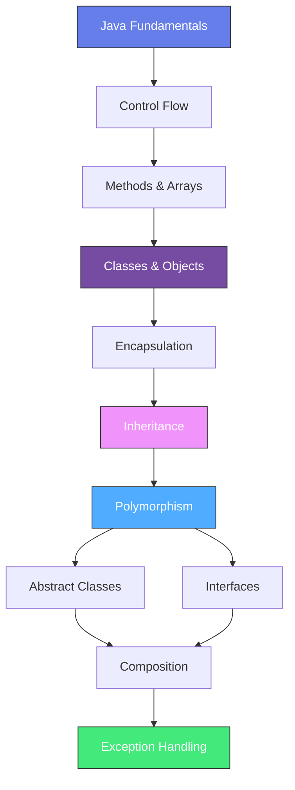

<div align="center">

# 📘 Object-Oriented Programming (OOP) — Java

### B6729875 | OOP Course Repository

[](https://www.java.com/)
[](https://en.wikipedia.org/wiki/Object-oriented_programming)
[](#)

_A comprehensive collection of Java exercises, labs, quizzes, and exams covering fundamental to advanced Object-Oriented Programming concepts._

---

</div>

## 📋 Table of Contents

- [Overview](#-overview)
- [Project Structure](#-project-structure)
- [Weekly Curriculum](#-weekly-curriculum)
- [Assessments](#-assessments)
- [Key OOP Concepts Demonstrated](#-key-oop-concepts-demonstrated)
- [Tech Stack](#-tech-stack)
- [Getting Started](#-getting-started)

---

## 🔎 Overview

This repository contains all coursework for the **Object-Oriented Programming (OOP)** course, organized weekly from foundational Java programming through advanced OOP design patterns. Each week includes both **lecture exercises** and **lab assignments** that progressively build upon core concepts.

---

## 🗂 Project Structure

```
B6729875/
│
├── week01/                # Java Basics & Hello World
├── week02/                # Variables, Expressions & Arithmetic
├── week03/                # Conditional Statements (if-else, switch)
├── week04/                # Loops & Arrays
├── week05/                # Methods & Static Members
├── week06/                # Classes & Objects
├── week08/                # Inheritance
├── week09/                # Abstract Classes & Interfaces
├── week10/                # Composition & Aggregation
├── week11/                # Exception Handling
│
├── excep/                 # Additional Exception Handling Exercises
├── Practice/              # Review & Practice Problems
├── Quiz/                  # In-class Quiz Solutions
├── prequiz/               # Pre-quiz Preparation Materials
├── practicelab8/          # Extended Lab Practice (Week 8)
├── pacfinal/              # Final Exam Practice
│
├── tu1/                   # Tutorial 1 — Abstract Classes (Beverage System)
├── B6729875_LabTest1/     # Lab Test 1 — Inheritance & Interfaces
├── B6729875_Labtest/      # Lab Test 2 — Employee Management System
├── LabTest3_01/           # Lab Test 3 — Encapsulation & Methods
│
└── โจทย์.pdf               # Course Assignment Specification (PDF)
```

> Each `weekXX/` directory is divided into `lecture/` (in-class demos) and `lab/` (graded assignments).

---

## 📅 Weekly Curriculum

| Week | Topic | Key Concepts | Notable Files |
|:----:|-------|--------------|---------------|
| **01** | Java Fundamentals | Program structure, `System.out.println`, compilation | `HelloWorld.java` |
| **02** | Variables & Expressions | Data types, arithmetic ops, quadratic equations, GPA calculation | `QuadraticEquation.java`, `GPACalculator.java` |
| **03** | Conditional Statements | `if-else`, `switch-case`, temperature conversion, number checking | `TemperatureConverter.java`, `DayslnMonth.java` |
| **04** | Loops & Arrays | `while`, `do-while`, `for`, array operations, pyramid patterns | `Pyramid.java`, `ArrayAverage.java` |
| **05** | Methods | Static vs instance methods, method parameters, return types | `TaxCalculator.java`, `MathOperations.java` |
| **06** | Classes & Objects | Constructors, encapsulation, `this` keyword, class design | `Student.java`, `ElectricityBill.java` |
| **08** | Inheritance | `extends`, `super`, method overriding, `@Override` | `Electronics.java`, `Animal.java` |
| **09** | Abstract Classes & Interfaces | `abstract`, `interface`, `implements`, polymorphism | `Shape.java`, `Taxable.java` |
| **10** | Composition | Object relationships, HAS-A pattern, data masking | `Person.java`, `Phone.java` |
| **11** | Exception Handling | `try-catch-finally`, custom exceptions, `throws` | `BankAccount.java`, `InsufficientFundsException.java` |

---

## 📝 Assessments

### 🧪 Lab Tests

| Assessment | Description | Concepts Tested |
|:----------:|-------------|-----------------|
| **Lab Test 1** | Employee & Manager hierarchy with `Displayable` interface | Inheritance, Interfaces, Polymorphism |
| **Lab Test 2** | Employee management with display capabilities | Interface implementation, Method overriding |
| **Lab Test 3** | Employee detail system with bonus calculation | Encapsulation, Getters/Setters, Business logic |

### 📋 Quizzes & Practice

| Component | Description |
|:---------:|-------------|
| **Quiz/** | In-class quiz solutions — algorithmic & OOP problems |
| **prequiz/** | Pre-quiz study materials and practice problems |
| **Practice/** | General review covering arrays, methods, strings |
| **practicelab8/** | Extended practice for inheritance concepts |
| **pacfinal/** | Final exam preparation exercises |

### 📚 Tutorials

| Tutorial | Topic | Description |
|:--------:|-------|-------------|
| **tu1** | Abstract Classes | Beverage ordering system — `Beverage` (abstract) → `Coffee`, `Tea` |

---

## 🧬 Key OOP Concepts Demonstrated



### Concept Highlights

- **Encapsulation** — Private fields with public getters/setters (`Electronics`, `Employee`, `Phone`)
- **Inheritance** — Class hierarchies using `extends` and `super()` (`Manager extends Employee`, `Coffee extends Beverage`)
- **Abstraction** — Abstract classes and methods (`Shape`, `Beverage`)
- **Interfaces** — Contract-based design with `implements` (`Taxable`, `Displayable`)
- **Polymorphism** — Method overriding with `@Override` across all inheritance hierarchies
- **Composition** — HAS-A relationships (`Person` has a `Phone`, `Employee` has a `JobInfo`)
- **Exception Handling** — Custom exceptions and defensive programming (`InsufficientFundsException`, `EquationException`)

---

## 🛠 Tech Stack

| Component | Detail |
|:---------:|--------|
| **Language** | Java (JDK 8+) |
| **Paradigm** | Object-Oriented Programming |
| **Build** | Manual compilation (`javac`) |
| **IDE** | VS Code / IntelliJ IDEA |

---

## 🚀 Getting Started

### Prerequisites

- **Java Development Kit (JDK)** 8 or higher installed
- Terminal / Command Prompt access

### Compile & Run

```bash
# Navigate to the project root
cd B6729875

# Compile a specific file (example: Week 06 Student lab)
javac week06/lab/lab1/Student.java week06/lab/lab1/Main.java

# Run the compiled class
java week06.lab.lab1.Main
```

### Run Lab Tests

```bash
# Lab Test 2 — Employee Management
javac B6729875_Labtest/*.java
java B6729875_Labtest.MainClass

# Lab Test 3 — Employee Details
javac LabTest3_01/*.java
java LabTest3_01.MainClass
```

---

<div align="center">

**B6729875** · Object-Oriented Programming Course · Java

</div>
